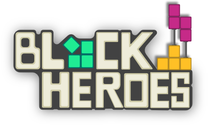

<p align="center"></p>

# Block Heroes

Multiplayer Tetrix like game written in [Beef](https://www.beeflang.org/) lang with [Ariyana](https://github.com/kochol/ariyana) game engine

Join our [Discord](https://discord.gg/RmKWW45) channel

[](https://discord.gg/RmKWW45)
[](https://gamejolt.com/games/blockheroes/515039)
[](https://twitter.com/BlockHeroes)
[](https://www.twitch.tv/blockheroes)
[](https://www.youtube.com/channel/UClMLFY20jWjCuZhvrhqLWew)

## Build from source

### Requirements

- **Python** (2.7.x or 3.x)
- **CMake** (3.6+)
- **A working C/C++ development environment**:
    - on **OSX**: Xcode + command line tools
    - on **Linux**: make/gcc (or clang)
    - on **Windows**: Visual Studio 2017 or better
- **Beef** Download the latest [nightly build](http://nightly.beeflang.org/BeefSetup.exe)

### Build for windows

```
mkdir ari
cd ari
git clone https://github.com/kochol/blockheroes.git
cd blockheroes
fips build
cd ..\ariyana\Beef\dist
make_cari.bat
```

Now you can open the blockheroes workspace with Beef IDE and run the game.

### Build server for linux

```
./BeefBuild_d -config=ServerDebug -run -workspace=/mnt/d/my/fips/block-heroes -verbosity=diagnostic
```